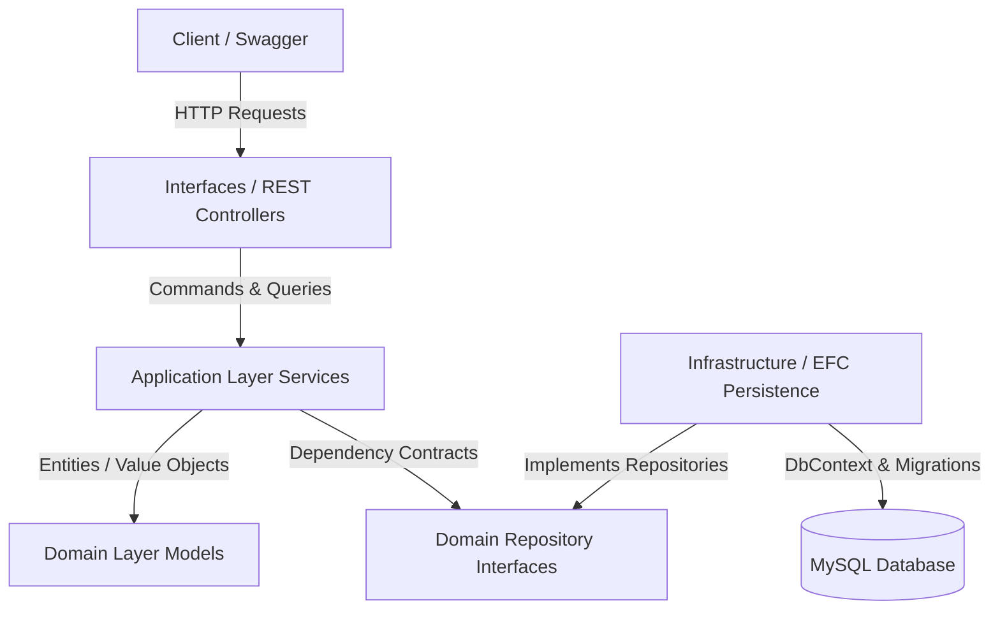

# Kipu Platform API

Kipu Platform API is a backend application designed for construction, engineering, and quality-control project management. Built using **.NET 10.0**, Entity Framework Core, and MySQL, the application follows a robust implementation of **Domain-Driven Design (DDD)** and the Command Query Responsibility Segregation (**CQRS**) pattern at the application level to ensure scalability, maintainability, and clear separation of concerns.

---

## 🏗️ Architecture & Project Structure

The project is structured around the principles of Domain-Driven Design (DDD). The system is partitioned into independent **Bounded Contexts** to capture specific business domains. 

Within each bounded context, the architecture is divided into the following layers:



### Layer Descriptions

*   **Domain**: The heart of the business logic. Contains **Aggregates**, **Entities**, **Value Objects**, **Commands/Queries** definitions, and the interfaces for **Repositories** (contracts). It is completely independent of databases, web frameworks, or third-party libraries.
*   **Application**: Implements the commands and queries handlers. Orchestrates domain behavior, manages transaction boundaries using Unit of Work, and converts input into domain rules.
*   **Infrastructure**: Implements persistence details, concrete repositories, and third-party integrations (e.g., MySQL mappings, Entity Framework Core `AppDbContext` mapping).
*   **Interfaces**: Exposes the application to the external world. Contains **REST Controllers**, request/response payload resources (DTOs), and **Assemblers** (mapeadores) to translate between HTTP requests and domain commands.

---

## 🧩 Bounded Contexts

Kipu Platform is composed of the following bounded contexts:

### 1. IAM (Identity and Access Management)
Manages user registrations, credentials, authentication tokens, and user permissions.
*   **Key Entities**: `User`
*   **Supported Roles**:
    *   `Administrador` (Administrator)
    *   `Gestor Operativo` (Operations Manager)
    *   `Logística y Administración` (Logistics & Admin)
    *   `Cliente` (Client)
    *   `Ingeniero` (Engineer)
*   **Base Routes**: `/api/v1/auth`, `/api/v1/users`

### 2. Projects
Handles construction project details, tracking progress, locations, and milestones.
*   **Key Entities**: `Project`, `ProjectItem` (tasks/sub-activities)
*   **Base Routes**: `/api/v1/projects`

### 3. Logistics
Controls material inventory, cataloging, categories, vendor listings, and the workflow for requesting materials and receiving offers.
*   **Key Entities**:
    *   `MaterialInventory` (stock levels per warehouse/project)
    *   `MaterialCatalog` (defined material items)
    *   `MaterialCategory` (classification of goods)
    *   `Supplier` (registered vendor companies)
    *   `SupplierOffer` (price proposals per supplier/material)
    *   `MaterialRequest` & `MaterialRequestItem` (procurement requests)
*   **Base Routes**: 
    *   `/api/v1/material-inventory`
    *   `/api/v1/materials-catalog`
    *   `/api/v1/categories-catalog`
    *   `/api/v1/supplier`
    *   `/api/v1/supplier-offers`
    *   `/api/v1/material-request`

### 4. Team
Tracks internal team users and field workers, including their assignments to specific machinery.
*   **Key Entities**:
    *   `TeamUser` (office-based workspace users)
    *   `TeamWorker` (field workers with registered DNI)
*   **Base Routes**: `/api/v1/team-users`, `/api/v1/team-workers`

### 5. Document
Organizes project-specific documentation, digital signature allocations, and signing statuses for team members.
*   **Key Entities**: `Document` (includes a collection of participating team members)
*   **Base Routes**: `/api/v1/documents`

### 6. Budget
Manages project financial tracking by organizing budget line items and recording spending transactions.
*   **Key Entities**: `BudgetItem`, `BudgetTransaction`
*   **Base Routes**: `/api/v1/budget-items`

### 7. Progress
Tracks the completion status of project activities by measuring actual versus planned completion percentages.
*   **Key Entities**: `ProgressItem`
*   **Base Routes**: `/api/v1/progress-items`

### 8. NCR (Non-Conformance Reports)
Quality control workflow management for documenting non-conformities, assigning severity, and detailing root causes and corrective actions.
*   **Key Entities**: `Ncr`
*   **Base Routes**: `/api/v1/ncrs`

---

## 🛠️ Technology Stack

*   **Runtime**: .NET 10.0 SDK
*   **Database**: MySQL Server 8.0+
*   **ORM**: Entity Framework Core 10.0
*   **MySQL Connector**: `MySql.EntityFrameworkCore` 10.0.7
*   **Documentation**: OpenAPI / Swashbuckle (Swagger)
*   **Localization**: native .NET Resource (`.resx`) files for Spanish/English support.

---

## 🚀 Getting Started

### 1. Prerequisites
Make sure you have the following installed on your machine:
*   [.NET 10 SDK](https://dotnet.microsoft.com/download/dotnet/10.0)
*   [MySQL Server](https://dev.mysql.com/downloads/mysql/) or running inside Docker.

### 2. Configuration
Open `appsettings.json` (or `appsettings.Development.json`) and configure your MySQL connection string:

```json
{
  "ConnectionStrings": {
    "DefaultConnection": "server=localhost;port=3306;user=root;password=YOUR_PASSWORD;database=kipu"
  }
}
```

### 3. Setup Entity Framework Core Tools
Restores tools defined in `dotnet-tools.json` (like `dotnet-ef` CLI):

```bash
dotnet tool restore
```

### 4. Database Migrations
To create or update the database schema based on the entities configured in `AppDbContext`, apply the migrations:

```bash
dotnet ef database update --project Kipu.API
```
> [!NOTE]
> On application startup, the system will automatically call `context.Database.Migrate()` to ensure the latest migrations are executed, and `context.Database.EnsureCreated()` to check that all database tables exist.

### 5. Running the Application
Launch the web server in hot-reload watch mode:

```bash
dotnet watch --project Kipu.API
```

By default, the server runs on:
*   HTTP: `http://localhost:5230`

---

## 📖 API Documentation & Localization

### Interactive API Explorer
Once the project is running, you can access the Swagger UI dashboard to explore and test the endpoints:
*   **Swagger URL**: `http://localhost:5230/swagger/index.html`
*   **OpenAPI Specification**: `http://localhost:5230/swagger/v1/swagger.json`

### Localization (i18n)
The application supports multi-language error messaging and validations (English `en` and Spanish `es`). 
*   **Default Culture**: `en`
*   **How it works**: The API uses the HTTP `Accept-Language` header to return localized messages.
*   **Swagger Integration**: A custom operation filter adds an `Accept-Language` header input dropdown to all endpoints in the Swagger UI. You can choose `en` or `es` directly before executing the request.
*   **RFC 7807 problem details** are localized dynamically when unexpected errors occur.

---

## 🔗 Endpoints Summary Reference

All routes are automatically converted to **kebab-case** by the route naming convention configured in `Program.cs`. Below is a non-exhaustive list of the main routing controllers:

| Endpoint | HTTP Method | Bounded Context | Description |
| :--- | :--- | :--- | :--- |
| `/api/v1/auth/sign-up` | `POST` | IAM | Register a new user in the platform |
| `/api/v1/auth/sign-in` | `POST` | IAM | Authenticate user and receive a JWT token |
| `/api/v1/users` | `GET` / `PUT` | IAM | Fetch users or update user roles |
| `/api/v1/projects` | `GET` / `POST` | Projects | Retrieve projects or create a new project |
| `/api/v1/material-inventory` | `GET` / `POST` | Logistics | Query stock details or record inventory entries |
| `/api/v1/materials-catalog` | `GET` / `POST` | Logistics | Retrieve or append cataloged materials |
| `/api/v1/categories-catalog` | `GET` / `POST` | Logistics | Manage categories for the materials catalog |
| `/api/v1/supplier` | `GET` / `POST` | Logistics | List suppliers or register a new supplier |
| `/api/v1/supplier-offers` | `GET` / `POST` | Logistics | Query and log special supplier offers |
| `/api/v1/material-request` | `GET` / `POST` | Logistics | Request materials for procurement |
| `/api/v1/team-users` | `GET` / `POST` | Team | Retrieve or assign project team members |
| `/api/v1/team-workers` | `GET` / `POST` | Team | Manage field workers and machinery assignments |
| `/api/v1/documents` | `GET` / `POST` | Document | Track project documents and digital signing statuses |
| `/api/v1/budget-items` | `GET` / `POST` | Budget | Register budget line items and register transactions/expenses |
| `/api/v1/progress-items` | `GET` / `POST` | Progress | Document planned vs actual task progress percentages |
| `/api/v1/ncrs` | `GET` / `POST` | NCR | Log Quality Control Non-Conformance Reports |
